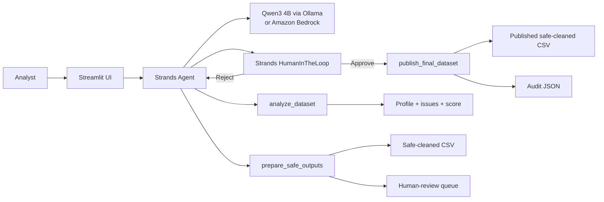

# Architecture

## Human-centered boundary

`analyze_dataset` and `prepare_safe_outputs` are allow-listed for autonomous execution because they either inspect data or apply the narrowly defined safe action of removing exact duplicate rows into a new file. `publish_final_dataset` is not allow-listed, so Strands HumanInTheLoop interrupts the real agent before publication. The user explicitly approves or rejects that consequential action, after which the same agent run resumes.
